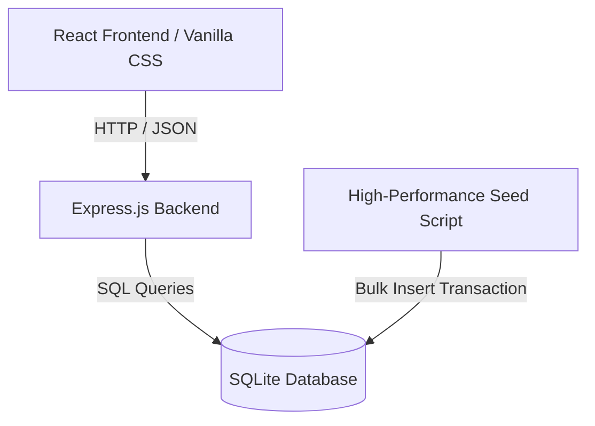

# Salary Management Tool - Architecture & Implementation Plan

This document outlines the product design, engineering architecture, seeding strategy, and development phases for the Salary Management Tool designed for an HR Manager of an organization with 10,000 employees.

---

## 1. Product Framing & User Experience (UX)

### User Persona: HR Manager
The HR Manager needs to maintain accurate employee records and gain swift, actionable salary insights to support compensation reviews, budgeting, and global parity analysis.

### Core Product Capabilities
1. **Interactive Dashboard (Salary Insights)**:
   - **Global Compensation Overview**: Total annual payroll budget, total headcount, overall average salary.
   - **Geographic Insights**: Interactive selection of a Country to view:
     - Minimum, Maximum, and Average salary.
     - Distribution of salaries within that country.
   - **Job Title & Country Analysis**: Dropdowns to see the average salary for any specific Job Title *within* a selected Country.
   - **Departmental Insights**: Average salary, headcount, and total budget by department.
2. **Employee Directory (CRUD & Search)**:
   - **High-Performance Grid**: Paginated table displaying the 10,000 employees, with support for server-side search, filtering (by country, department, and job title), and sorting (by name or salary).
   - **Add/Update Employee Modal**: Simple, validated form to add or edit employee details (Full Name, Email, Job Title, Department, Country, Salary, Hire Date, Status).
   - **Delete Employee**: Secure deletion with a confirmation workflow.

---

## 2. Technical Stack & Architecture

We will implement a clean, lightweight, and modern stack that ensures ultra-fast performance, simple deployment, and local execution:

### Backend Architecture
- **Runtime**: Node.js
- **Framework**: Express.js
- **Database**: SQLite (via `better-sqlite3` or `sqlite3` driver).
  - *Decision*: `better-sqlite3` is chosen because it is synchronous, extremely fast, and has superior performance for bulk operations and transaction handling compared to asynchronous drivers.
- **Testing**: Jest & Supertest for end-to-end API testing.

### Frontend Architecture
- **Framework**: React.js (via Vite for instantaneous hot-reloading and modern build tooling)
- **Styling**: Vanilla CSS with custom properties (CSS variables) to build a premium, responsive interface (glassmorphism, dark/light balanced theme, sleek modern typography, micro-animations). No bloated utility frameworks.
- **Charts**: Recharts or Chart.js for beautiful, responsive visualizations.

---

## 3. Database Schema

We will use a relational schema in SQLite. To support 10,000 employees, the schema must be fully indexed on search-heavy fields.

### `employees` Table
| Column Name | Type | Constraints | Description |
| :--- | :--- | :--- | :--- |
| `id` | INTEGER | PRIMARY KEY AUTOINCREMENT | Unique employee identifier |
| `full_name` | TEXT | NOT NULL | Employee's full name |
| `email` | TEXT | NOT NULL UNIQUE | Work email address |
| `job_title` | TEXT | NOT NULL | Job title (e.g., Software Engineer) |
| `department` | TEXT | NOT NULL | Department (e.g., Engineering, Sales) |
| `country` | TEXT | NOT NULL | Country of residence |
| `salary` | REAL | NOT NULL | Annual salary in USD equivalent |
| `hire_date` | TEXT | NOT NULL | ISO Date (YYYY-MM-DD) |
| `status` | TEXT | NOT NULL | Status (Active, Terminated, On Leave) |
| `created_at` | TEXT | DEFAULT CURRENT_TIMESTAMP | Record creation time |
| `updated_at` | TEXT | DEFAULT CURRENT_TIMESTAMP | Record update time |

### Indexes
To keep search, filter, and aggregate statistics operations lightning-fast (sub-millisecond) for 10,000 records, we will create the following indexes:
- `idx_employees_country_job_title` on `(country, job_title)` (optimizes salary insights queries)
- `idx_employees_department` on `(department)` (optimizes department breakdown queries)
- `idx_employees_search` on `(full_name, email)` (optimizes text search queries)

---

## 4. Seeding Strategy & Performance

### Seeding Requirements
- Seed exactly 10,000 records.
- Names must be combinations of first names from `first_names.txt` and last names from `last_names.txt`.
- Performance is critical (must run in < 1 second).

### Performance Optimization Techniques
1. **SQLite Transaction (`BEGIN TRANSACTION` / `COMMIT`)**:
   - By default, SQLite commits each individual insert to disk, creating severe bottlenecks (taking minutes for 10,000 records). Wrapping the inserts in a single transaction maintains operations in memory and commits once, bringing the duration down to **~30–50ms**.
2. **Prepared Statements**:
   - Reusing a single prepared statement compile step and binding parameters in a loop avoids SQL parsing overhead.
3. **Array Generation**:
   - Generate `first_names.txt` (100 names) and `last_names.txt` (100 names) to create exactly $100 \times 100 = 10,000$ unique combinations, ensuring a deterministic list of unique employees.

---

## 5. Development & Commit Strategy

We will build the application incrementally, making clear, atomic Git commits for each logical step:
1. **Initial Setup**: Set up project structure, create name dictionaries (`first_names.txt` & `last_names.txt`).
2. **Database & Seeding**: Implement the schema, the optimized seed script, and performance profiling.
3. **Backend API**: Build the Express.js routes for CRUD, pagination, and insights. Add Unit/Integration tests.
4. **Frontend Foundation**: Set up the React application, routing, and core CSS variable styling system.
5. **Dashboard & Analytics UI**: Implement the main metrics display, graphs, and country filters.
6. **Employee Grid UI**: Build the paginated, searchable grid with Add/Update/Delete dialogs.
7. **End-to-End Validation**: Verify performance, styling premiumness, test coverage, and documentation.

---

## 6. Testing Plan

### Backend Tests
- **Database Operations**: Test connection, schema creation, seed validity.
- **REST Endpoints**: Test CRUD operations via `supertest` with proper validation.
- **Aggregate Analytics**: Verify the correctness of calculations (Min, Max, Avg) against a mock database.

### Frontend Integration
- Verify mock API integration.
- Ensure proper form validation for creating/updating employees (prevent negative salaries, empty names).
